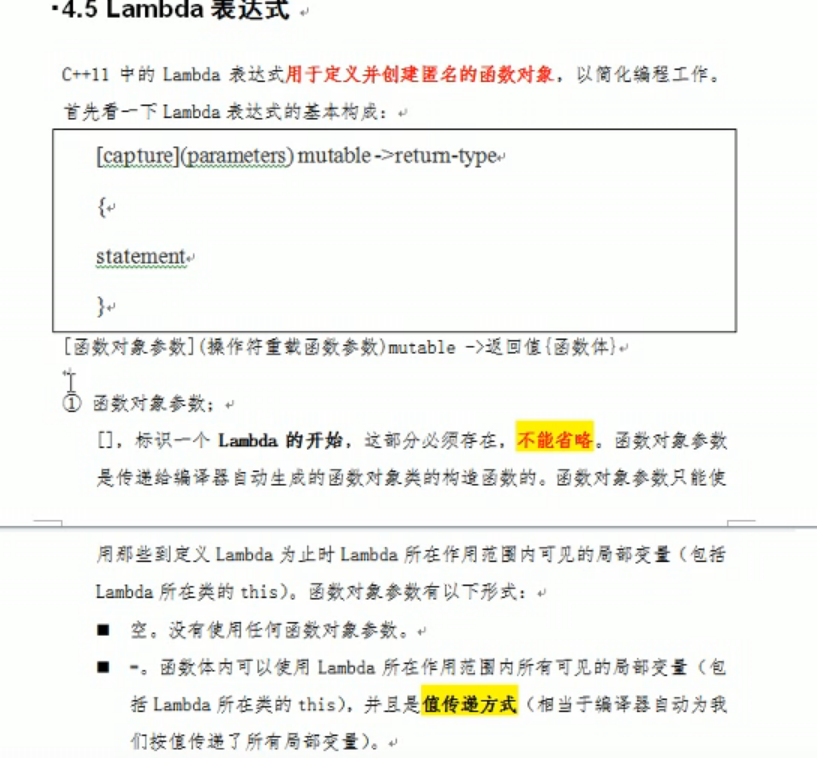

# 0. QT 安装

账号： 1810750396@qq.com

密码：599218496.a

# 0.1 学习方法

1. 学习语句创建
2. 理解每一句的意思
3. 学习完后，实践，做项目 

# 0.2 疑问点

1. 对象树
2. 

# 1. 创建项目

# 2. qt开发界面介绍


# 3.  创建第一个QT程序

## 1. 注意事项

1. 点击创建项目后，选择项目路径以及给项目其名称
2. 名称， 不能有中文，不能有空格
3. 路径，不能有中文路径
4. 默认创建有窗口类，myWidget ，基类有三种选择： QWidget, QMainWindow,QDialog.
5. main 函数
   - QApplication a  应用程序对象，有且仅有一个
   - myWidget w 实例化窗口对象
   - w.show 调用show 函数，显示敞口
   - return a.exc() 让应用程序对象进入消息循环机制中，代码阻塞到当前行     


## 2.  按钮控件常用API

1. 创建 QPushButton * btn = new QPushButton 
2. 设置父亲，让按钮在父元素框中  setParent(this)
3. 设置文本   setText (" 文字")
4. 设置位置 move (宽，高)
5. 重新设置按钮大小  resize(x,y)
6. 设置窗口标题   setWindosTitle 
7. 设置窗口固定大小   setfixedSize(x,y) 


```c++
#include "mainwindow.h"
#include "./ui_mainwindow.h"
#include <QPushButton>  // 按键控件的头文件

MainWindow::MainWindow(QWidget *parent)
    : QMainWindow(parent)
    , ui(new Ui::MainWindow)
{
    //ui->setupUi(this);

    //创建一个按钮
    QPushButton * btn = new QPushButton;
    //btn->show();   // show 以顶层方式弹出窗口控件
    // 让btn 对象 依赖在MyWidget 窗口中

    btn->setParent(this);

    btn->setText("第一个按钮");
    //制定按钮大小
    btn ->resize(100,100);

    // 创建第二个按钮，按照控件的大小创建窗口，会很小， 需要调用其他函数放大窗口
    QPushButton *btn2 = new QPushButton("第二个按钮",this);

    btn2->move(100,200);

    // 重置窗口大小
    resize(600,600);

    // 设置固定窗口大小
    setFixedSize(600,600);

    //设置窗口标题
    setWindowTitle("第一个窗口");


}

MainWindow::~MainWindow()
{
    delete ui;
}


```

## 3. 对象树 

 当创建的对象在堆区的时候，如果指定的父亲是QObject 派生下的类，或者QObject 子类派生下的类，可以不用管理释放的操作，将对象会放入到对象树中。

一定程度上简化了内存回收机制


就是代码往下跑，先打印了父类的析构函数内容，但是此时这个析构函数还没有析构，因为还要找它有没有子类要析构。

## 4. QT中的窗口坐标系

坐标体系：

以左上角为原点（0，0） ，x向右增加，y向下增加


# 4. 信号与槽

##  1. 信号和槽

  


连接参数：  connect 

参数： 

```C++
 //需求：点击我的按钮  关闭窗口
 //参数1 信号的发送者  参数2 发送的信号（函数的地址） 参数3 信号的接收者 参数 4 处理的槽函数      
 connect(btn, &QPushButton::clicked,this, &QWidget::close);
```

松散耦合 

实现 点击按钮  关闭窗口的案例

connect()

## 2. 自定义的信号和槽

1. 自定义信号   
   - 返回void
   - 需要声明，不需要实现
   - 可以有参数
   - 写道signals 下

2. 自定义槽函数
   - 返回void
   - 需要声明，也需要实现
   - 可以有参数,可以重载
   - 写到 public slot下，或者public 或者全局函数

3.  触发自定义信号：
   - emit  自定义信号

4. 案例： 下课后，老师饿了，触发饿了信号，学生响应信号，请老师吃饭

5. 项目： qt_project 004 


## 3. 自定义的信号和槽发生重载的解决


当自定义信号和槽出现重载

1. 需要利用函数指针，明确指向函数的地址
2. void ( Teacher:: * teacherSignal)(QString )= & Teacher:;hungry; 
3. QString 转成 char * 
   - .ToUtf8()  转为 QBytrArray 
   - .Data( )  转为 char * 


信号可以连接信号

断开信号  disconnect 


## 4.  QT4 版本信号槽版本连接


QT4版本  底层 SIGNAL （"hungry()"),        SLOT("treat ")


扩展：

1. 信号可以连接信号
2. 一个信号可以连接多个槽函数
3. 多个信号可以连接同一个槽函数    一对多  
4. 信号和槽函数的参数，必须类型一一对应
5. 信号和槽的参数个数  是不是一致？  信号参数的个数可以多于槽的参数


## 5. Lambda 表达式




C++ 11 中的 lambda表达式用于定义并创建匿名的函数对象，以简化编程工作，

首先看一下，Lambda表达式的基本构成

[capture list ] (parameters  list ) mutable ->return-type 

{

​        **function body** 

} 

   **capture list :** **捕获列表**      一个lambda所在函数中定义的局部变量的列表*通常为空

​    **return type : 返回类型**

​    **parameter list：参数列表**

​    **function body: 函数体** 


```c++

      QPushButton *btn1 = new QPushButton("下课",this);
      QPushButton *btn2 = new QPushButton("上课",this);


      btn2->move(100,100);

      int m=10;

      // mutable 关键字， 用于修饰值传递的变量，修改的是拷贝，而不是本体
      connect(btn2,&QPusButton::clicked,this,[m]()mutable{m=100+10;qDebug()<<m;});


      connect(btn,&QPushButton::clicked,this,[m](){qDebug()<<m;});
```


1.  =  值传递
2. & 引用传递
3. () 参数
4. {} 实现体
5. mutable 修饰 值传递变量，可以修改拷贝出的数据，改变不了本体
6. 返回值  []() -> int {}


```c++
// lambda 表达式  最常用   [ = ](){}
   
```


## 6. 总结


# 5. QMainWindow 

QMaubWindow   是一个为一个用户提供主窗口程序的类，包含一个菜单栏（menu bar) ,多个工具烂(tool  bars) ，多个锚接部件，（dock widget)  一个状态栏 (status bar ) 及一个中心部件(central widget) ，是许多应用程序的基础，如文本编译器，图片编译器。


## 1. 菜单栏

最多有一个， 

1. 


## 2.状态栏

1. 最多有一个


程序： 


```c+=
#include "mainwindow.h"
#include <QMenuBar>
#include <QToolBar>


#include <QPushButton>

#include <QStatusBar>

#include <QLabel>


#include <QDockWidget>

#include <QTextEdit>

MainWindow::MainWindow(QWidget *parent)
    : QMainWindow(parent)
{
    //重置窗口
    resize(600,400);
    
    // 菜单栏创建
    QMenuBar *bar = menuBar();

    //将菜单栏放入到窗口中
    setMenuBar(bar);

    //创建菜单
     QMenu * fileMenu   =   bar->addMenu("文件");

     QMenu * editMenu   =   bar->addMenu("编辑");

    //创建菜单项

     QAction * newAction =  fileMenu->addAction("新建");

     QAction * openAction = editMenu->addAction("文件");

     //工具栏 可以有多个
     QToolBar * toolBar = new QToolBar(this);

     addToolBar(Qt::LeftToolBarArea,toolBar);

    // 后期设置 只允许 左右停靠
     toolBar->setAllowedAreas(Qt::LeftToolBarArea|Qt::RightToolBarArea);
    //设置浮动
     toolBar->setFloatable(false);
    //设置移动 （总开关）
     toolBar->setMovable(false);

    //工具栏中可以设置内容
     toolBar->addAction(newAction);

     //添加分割线
     toolBar->addSeparator();

     toolBar->addAction(openAction);

    QPushButton *btn =  new QPushButton("aa",this);

    toolBar->addWidget(btn);


    //状态栏  最多有一个
   QStatusBar * stBar = statusBar();

   // 设置到当前窗口中
   setStatusBar(stBar);
   //放标签控件   状态栏中放的是标签控件

   QLabel * label = new QLabel("提示的信息",this);

   stBar->addWidget(label);

   QLabel * label2= new QLabel("右侧提示信息",this);

   stBar->addPermanentWidget(label2);


   // 锚接部件 (浮动窗口） 可以有多个
   QDockWidget * dockWidget = new QDockWidget ("浮动",this);
   addDockWidget(Qt::BottomDockWidgetArea,dockWidget);

   //设置后期停靠区域,只允许上下
   dockWidget ->setAllowedAreas(Qt::TopDockWidgetArea|Qt::BottomDockWidgetArea);

    //设置中心部件 只能一个
   QTextEdit * edit = new QTextEdit(this);

   setCentralWidget(edit);


}
MainWindow::~MainWindow()
{

}
```

## 3. 资源文件

资源文件添加， 添加后在项目中找不到文件


1. 将图片 拷贝到项目位置下
2. 右键项目-> 添加新文件->QT->QT recour se Fole -> 给资源文件起名
3. res 生成  res.qrc 
4. open in editor  编辑资源
5. 添加前缀  添加文件
6. 使用 ": + 前缀名+ 文件名"


## 4. 模态和非模态对话框创建

分类;   

模态对话框  不可以对其他窗口进行操作  阻塞

  QDialog dil(this) 

 dig.exec()

非模态对话框  可以对其他窗口进行操作

防止一闪而过，创建到堆区

QDialog * dlg = new QDialog（this)

dlg - >show()

dlg -> setAttribute (QT:: WA_DeleteOnClose )  // 55号属性  


## 5. 消息对话框

### 1. 标准对话框

所谓标准对话框，是Qt 内置的一系列对话框，用于简化开发

QT 的内置对话框大致分为这几类 


### 2. 自定义对话框


注意不同的图标


 

```c++
#include "mainwindow.h"
#include "./ui_mainwindow.h"


#include <QDialog>
#include <QDebug>

#include <QMessageBox>
MainWindow::MainWindow(QWidget *parent)
    : QMainWindow(parent)
    , ui(new Ui::MainWindow)
{
   //点击新建按钮， 弹出一个对话框
    ui->setupUi(this);


    connect(ui->action_new,&QAction::triggered,[=]()
    {
        // 对话框 分类
        //  模态对话框（不可以对其他窗口操作） 非模态对话框  （可以对其他窗口进行操作）
        // 模态创建  阻塞

//      QDialog   dlg(this);
//      dlg.resize(200,100);
//      dlg.exec();
//      qDebug()<<"模态对话框弹出了";


      //非模态对话框
//      QDialog *dlg2 = new QDialog(this);

//      dlg2->resize(200,200);
//      dlg2->show();
//      dlg2->setAttribute(Qt::WA_DeleteOnClose);

//      qDebug()<<"非模态对话框弹出了";


       // 消息对话框
       // 错误对话框
       // QMessageBox::critical(this,"critical","错误");  // 模态对话框


      // 信息对话框
      // QMessageBox::information(this,"critical","信息");  // 模态对话框


      // 警告对话框
      // QMessageBox::warning(this,"warning","警告");


    }


    );
}

MainWindow::~MainWindow()
{
    delete ui;
}


```


### 3. 标准对话框 - 消息对话框


1. QMessageBox   静态成员函数  创建对话框
2. 错误，信息，提问，警告
3. 参数1  父亲  参数2 标题   参数3 显示内容   参数4 按键类型     参数5 默认关联回车按键
4. 返回值   也是 StandardButton 类型  ，利用返回值判断用户输入  

#### 扩展


## 6. 登录窗口布局

程序： project 006 

1. 实现登录窗口
2. 利用布局方式，给窗口进行美化
3. 选取widget  进行布局，水平布局，垂直布局，栅格布局
4. 给用户名，密码，登录，退出按钮，进行布局
5. 默认窗口和控件之间有 9 间隙  可以调整layoutLeftMargin 


## 7. 控件-按钮组 


QPushButton  常用工具

QToolButton   工具按钮  用于显示图片 如果想显示文字 ，修改风格

toolButtonStyle   ,  凸起风格  autoRaise   

radioButton  单选按钮，设置默认  ui->rBtnMan->setChecked(ture)

checkbox  多选按钮，监听状态  2  选中   1 半选  0 未选中  


# 6. QListWidget 控件 


# 嵌入式QT开发


# 1.  QT编程规范


1. 文件命名都是小写字母
2. 类的首字母是大写，单词和单词之间首写字母是大写
3. 除了构造函数和析构函数，成员函数的首写字母都是小写
4. 变量首字母是大写，单词和单词之间首写字母是大写
5. contr+ i  格式化对齐 


# 2. 自定义信号槽

 


# 项目介绍


