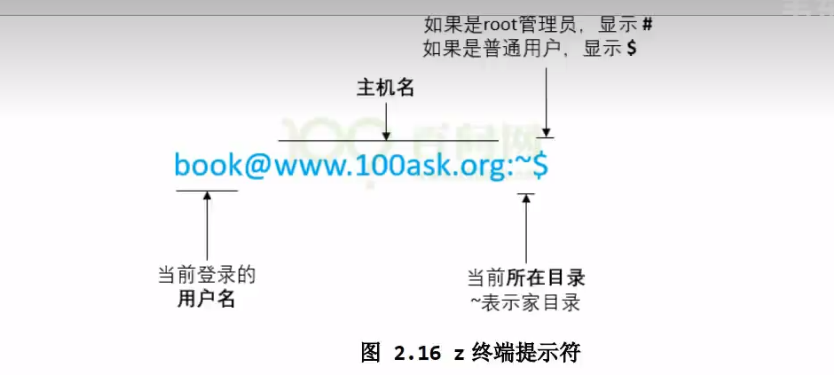

# 0. 1资源

单片机： IMX6ULL 开发板

# 0.2 课程安排

课程时间： 37小时，27分钟     记38个学时

9月22日      p0  -      

# 0.3  疑问

1. 挂载    
2. gedit
3. 熟练使用shell，能独立写一些程序，循环，判断
4.  ls -l   查看文件权限

# 0.4 学习方向

嵌入式linux 软件工程师      

 应用层  

# 0.5 快捷键

1. ctrl + u    清除命令 	

# 1.学习路线与课程体系

 先学习应用程序，再学习驱动程序，再学习项目

  1.APP   2.DRV  3.项目

##  1.2 资料如何下载

# 2.安装虚拟机

windos 不支持链接文件  ,不支持设备节点，必须在linux下做。 

## 2.1 虚拟机安装

## 2.2 ubuntu和windosw 的比较

 最大的差别：目录

挂载

## 2.3 shell 脚本命令解析和PATH环境变量

### 1. Linux 命令的格式

1. command 命令
2. options选项
3. parameter参数

### 2. shell 是什么

shell 就是一个应用程序，我们可以通过键盘，串口给他发送指令，回车后它就会去执行这些命令

以  ls- l 命令为例

1. 接收键盘数据并**回显**
2. 解析输入的字符串寻找程序，执行程序
   - shell会解析字符串，这些字符串用空格分为好几个部分
     - 第一部分就是程序名，命令名
     - 其他部分是参数
   - shell 会去寻找该程序，去哪里找？ 去PATH 环境变量所指示的位置找
     - 当然你也可以指定绝对路径，相对路径，shell就会直接去这些路径找到程序
   - 找到程序后，会启动该程序，并传入参数

### 3. 环境变量

## 2.4  目录与文件操作命令

 ~ ： 家目录

rm -rf    

文件前有.  的文件为隐藏文件

mv       

# 10. 系统编程

## 一.黑马程序员

### 2. 类Unix 系统目录

linux 系统，所见皆文件

bin：存放二进制可执行文件

boot: 存放开机启动程序

dev： 存放设备文件

home： 存放用户

etc:   用户信息和系统配置文件

lib: 库文件

root: 管理员宿主目录（家目录）

usr：  用户资源管理目录

### 3. 目录和文件操作

# 11.网络编程

## 1. socoket 

