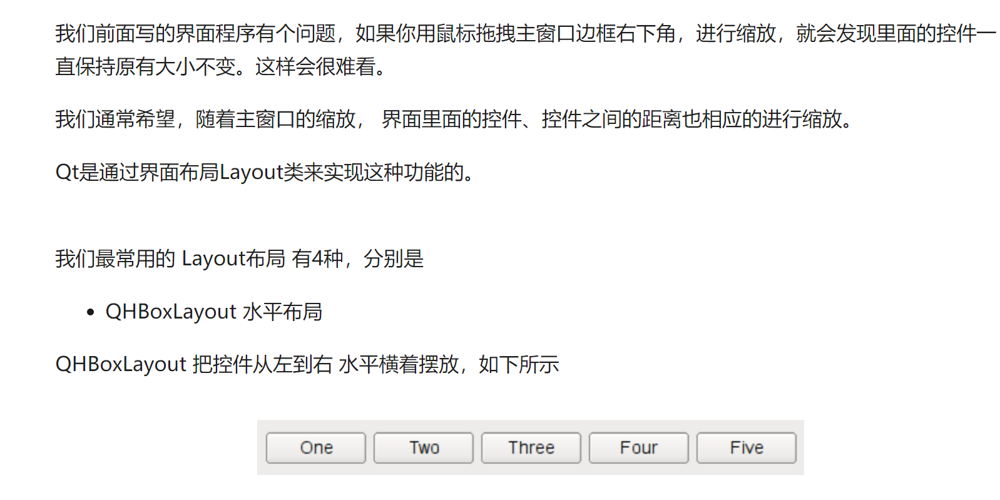

# 0. 教学网址

```http
https://www.byhy.net/tut/py/gui/qt_01/
```


# 1. 简介和安装

## 简介


## 安装：


# 2 . 第一个案例

```python

from PySide2.QtWidgets import QApplication, QMainWindow, QPushButton,  QPlainTextEdit


# 创建一个对象
app = QApplication([])

window = QMainWindow()

# 控制窗口大小
window.resize(1000, 800)
# 控制窗口出现位置
window.move(300, 310)
# 窗口标题
window.setWindowTitle('薪资统计')
# 纯文本
textEdit = QPlainTextEdit(window)
# 文本框中的 提示文本
textEdit.setPlaceholderText("请输入薪资表")
textEdit.move(10,25)
textEdit.resize(300,350)


# 按钮    （标题，父窗口）
button = QPushButton('统计', window)
button.move(380,80)

window.show()

# 事件处理循环   程序循环等待 用户输入   死循环
app.exec_()
```


# 3. 用户操作处理 signal  slot 


```python
from PySide2.QtWidgets import QApplication, QMainWindow, QPushButton,  QPlainTextEdit,QMessageBox

def handleCalc():
    info = textEdit.toPlainText()

    # 薪资20000 以上 和 以下 的人员名单
    salary_above_20k = ''
    salary_below_20k = ''
    for line in info.splitlines():
        if not line.strip():
            continue
        parts = line.split(' ')
        # 去掉列表中的空字符串内容
        parts = [p for p in parts if p]
        name,salary,age = parts
        if int(salary) >= 20000:
            salary_above_20k += name + '\n'
        else:
            salary_below_20k += name + '\n'

    QMessageBox.about(window,
                '统计结果',
                f'''薪资20000 以上的有：\n{salary_above_20k}
                \n薪资20000 以下的有：\n{salary_below_20k}'''
                )

app = QApplication([])

window = QMainWindow()
window.resize(500, 400)
window.move(300, 300)
window.setWindowTitle('薪资统计')

textEdit = QPlainTextEdit(window)
textEdit.setPlaceholderText("请输入薪资表")
textEdit.move(10,25)
textEdit.resize(300,350)

button = QPushButton('统计', window)
button.move(380,80)
button.clicked.connect(handleCalc)

window.show()

app.exec_()
```

 

上面的代码把控件对应的变量名全部作为全局变量。

如果要设计稍微复杂一些的程序，就会出现太多的控件对应的变量名。

而且这样也不利于 代码的模块化。

所以，我们通常应该把 一个窗口和其包含的控件，对应的代码 全部封装到类中，如下所示

```python
from PySide2.QtWidgets import QApplication, QMainWindow, QPushButton,  QPlainTextEdit,QMessageBox

class Stats():
    def __init__(self):
        self.window = QMainWindow()
        self.window.resize(500, 400)
        self.window.move(300, 300)
        self.window.setWindowTitle('薪资统计')

        self.textEdit = QPlainTextEdit(self.window)
        self.textEdit.setPlaceholderText("请输入薪资表")
        self.textEdit.move(10, 25)
        self.textEdit.resize(300, 350)

        self.button = QPushButton('统计', self.window)
        self.button.move(380, 80)

        self.button.clicked.connect(self.handleCalc)


    def handleCalc(self):
        info = self.textEdit.toPlainText()

        # 薪资20000 以上 和 以下 的人员名单
        salary_above_20k = ''
        salary_below_20k = ''
        for line in info.splitlines():
            if not line.strip():
                continue
            parts = line.split(' ')
            # 去掉列表中的空字符串内容
            parts = [p for p in parts if p]
            name,salary,age = parts
            if int(salary) >= 20000:
                salary_above_20k += name + '\n'
            else:
                salary_below_20k += name + '\n'

        QMessageBox.about(self.window,
                    '统计结果',
                    f'''薪资20000 以上的有：\n{salary_above_20k}
                    \n薪资20000 以下的有：\n{salary_below_20k}'''
                    )

app = QApplication([])
stats = Stats()
stats.window.show()
app.exec_()
```


# 4. QT designer


保存到-> ui 文件夹


# 5. 动态加载UI文件

 有了界面定义文件，我们的Python程序就可以从文件中加载UI定义，并且动态 创建一个相应的窗口对象。 


```python
from PySide2.QtWidgets import QApplication, QMessageBox
from PySide2.QtUiTools import QUiLoader
from PySide2.QtCore import  QFile
class Stats:

    def __init__(self):
        # 从文件中加载UI定义
        qfile_stats= QFile("ui/stats.ui")
        qfile_stats.open(QFile.ReadOnly)
        qfile_stats.close()

        # 从 UI 定义中动态 创建一个相应的窗口对象
        # 注意：里面的控件对象也成为窗口对象的属性了
        # 比如 self.ui.button , self.ui.textEdit
        self.ui = QUiLoader().load(qfile_stats)

        self.ui.button.clicked.connect(self.handleCalc)

    def handleCalc(self):
        info = self.ui.textEdit.toPlainText()

        salary_above_20k = ''
        salary_below_20k = ''
        for line in info.splitlines():
            if not line.strip():
                continue
            parts = line.split(' ')

            parts = [p for p in parts if p]
            name,salary,age = parts
            if int(salary) >= 20000:
                salary_above_20k += name + '\n'
            else:
                salary_below_20k += name + '\n'

        QMessageBox.about(self.ui,
                    '统计结果',
                    f'''薪资20000 以上的有：\n{salary_above_20k}
                    \n薪资20000 以下的有：\n{salary_below_20k}'''
                    )

app = QApplication([])
stats = Stats()
stats.ui.show()
app.exec_()
```


# 6. 一个小练习

需要了解：

1. http 协议
2. 接口测试概述
3. requests 库  session 机制
4. 


# 7. 界面布局 Layout





